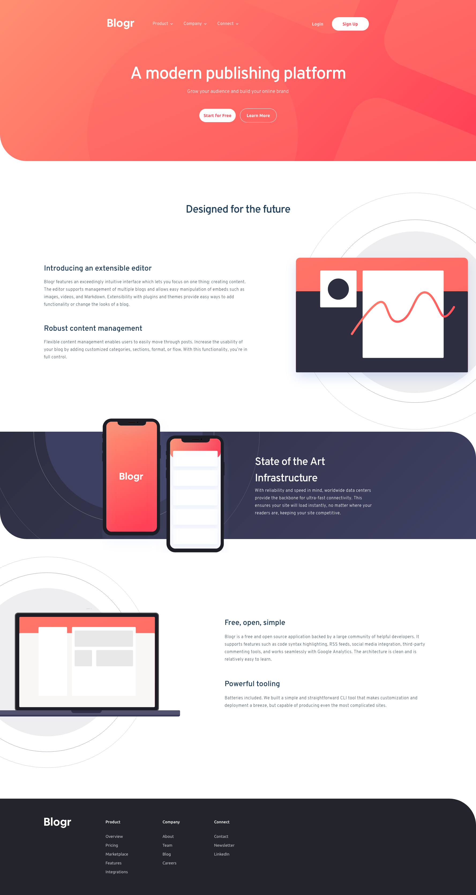

# Blogr landing page

Live Site URL: [Blogr](https://blogr-babs.netlify.app/)

This is a solution to the [Blogr landing page challenge on Frontend Mentor](https://www.frontendmentor.io/challenges/blogr-landing-page-EX2RLAApP). I wanted to get more experience in building designs from mockups in Figma, and ended up finding lots of projects just like this on Front End mentor. This helped me from stressing about designing everything from the ground up, so I could just focus on practicing my front end dev skills!

## Table of contents

- [Overview](#overview)
  - [Screenshot](#screenshot)
  - [Links](#links)
- [My process](#my-process)
  - [Built with](#built-with)
  - [Summary](#what-i-learned)
- [Author](#author)

## Overview

### Screenshot

### Links

- Live Site URL: [Blogr](https://blogr-babs.netlify.app/)

## My process

### Built with

- Semantic HTML5 markup
- CSS
- Mobile-first workflow
- [React](https://reactjs.org/) - JS library
- [Styled Components](https://styled-components.com/) - For styles

### Summary

One of the things I learned about more during this exercise was the `display` CSS property. Mainly when using the `display: relative;` and the `display: absolute;`. When using a lot of stacking context, it was important to have good understanding of the property and how each element will be affected when it is used on its parent or child elements.

One challenge I faced during development was in the figma design itself. It was not very consistent in its spacing and most of the time it felt completely random what margin or padding was used between and in elements. This felt very sloppy since it was not adhering to some type of design system. Although, I enjoyed the challenge of working around this inconvience.

This was the first time using [Styled Components](https://styled-components.com/) after being stuck on the [TailwindCSS](https://tailwindcss.com/) train for my last couple of projects. I found this a good middle ground between CSS in stylesheets and the easy and fast paced nature of Tailwind which I enjoy so much. I know Tailwind is a bit of controversial thing in the dev world since some believe it clutters the HTML markup, so I took this opportunity to grow my CSS knowledge using another popular CSS solution.

## Author

- Website - [Brady Blair](https://bradyblair.netlify.app/)
- LinkedIn - [Brady Blair](https://www.linkedin.com/in/bradyblair20/)
